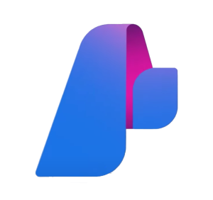
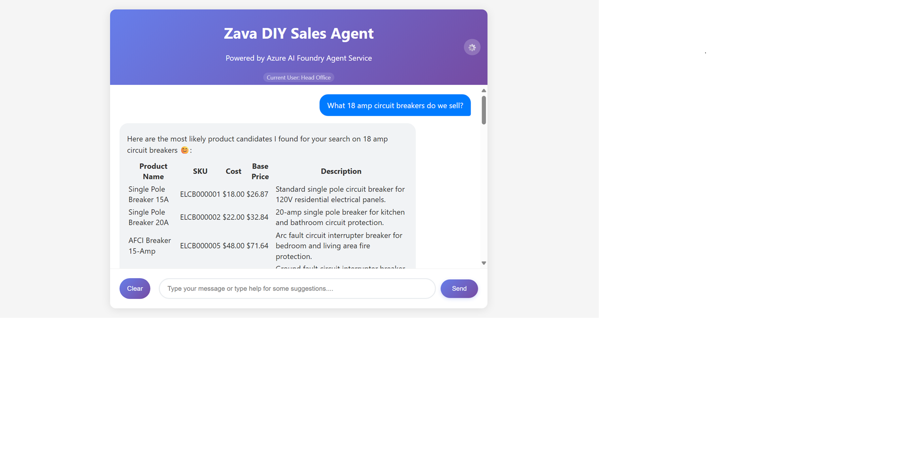

#  Azure AI Foundry with Model Context Protocol and PostgreSQL

### 📋 Description

Build a conversational AI agent that analyzes sales data and helps customers find products. Learn to create secure, intelligent agents using Azure AI Foundry Agent Service, Model Context Protocol (MCP) for external data connections, and PostgreSQL with Row Level Security (RLS) and pgvector for role-based data protection and semantic search.


### 💻 Technologies Used

1. Azure AI Foundry
2. PostgreSQL including Row Level Security (RLS) and Semantic Search with the pgvector extension
3. Model Context Protocol (MCP)

### ⚙️ Set Up

This sample uses [`azd`](https://learn.microsoft.com/azure/developer/azure-developer-cli/) and a bicep template to deploy all Azure resources:

1. Python Environment Setup

```bash
python3.11 -m venv .venv
source .venv/bin/activate  # On Windows: .venv\Scripts\activate
pip install -r requirements.txt
```

2. Login to your Azure account: `azd auth login`

3. Deploy the Infrastructure

```bash
cd infra && ./deploy.sh
```
The deploy script generates the .env file, which contains the project and model endpoints, model deployment names, and Application Insights connection string. The .env file will automatically be saved in the src/python/workshop folder.


### 🏃 Run the Application 

1. **Start the database server**
    ```bash
    docker-compose up db -d
    ```

2. **Add the environment variable** (since the database is running inside a local container)
    ```bash
    POSTGRES_URL=<your-local-container-address>
    ```

3. **Start the MCP server**
    ```bash
    python src/python/mcp_server/sales_analysis/sales_analysis.py
    ```

4. **Start the dev tunnel**
    ```bash
    cd src/python/workshop
    # Run DevTunnel script
    bash ../../shared/scripts/start_devtunnel.sh
    ```

5. **Start the backend**
    ```bash
    python src/python/workshop/app.py
    ```

6. **Start the frontend**
    ```bash
    cd src/shared/webapp/
    python app.py
    ```

### 🚀 Usage

Open your web browser and navigate to the frontend application. Start asking questions!

<p align="center">

</p>

### 🗑️ Delete resources

To delete the Azure resources:

1. Visit the Azure Portal
2. Click **Resource groups**
3. Click on your resource group **rg-agent-workshop-****
4. Click **Delete Resource group**
5. In the field at the bottom "Enter resource group name to confirm deletion" enter **rg-agent-workshop-****
6. Click **Delete**
7. At the Delete Confirmation prompt, click **"Delete"**

Then cleanup the resources with the script:

    ```bash
    bash infra/cleanup-deleted-resources.sh
    ```